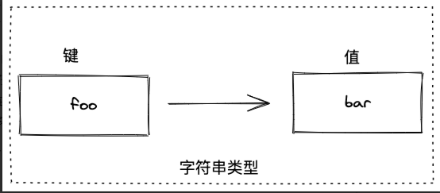
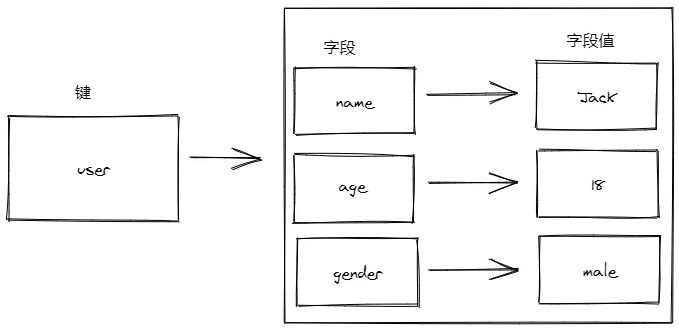
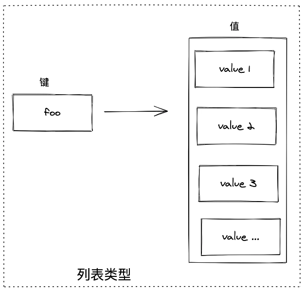
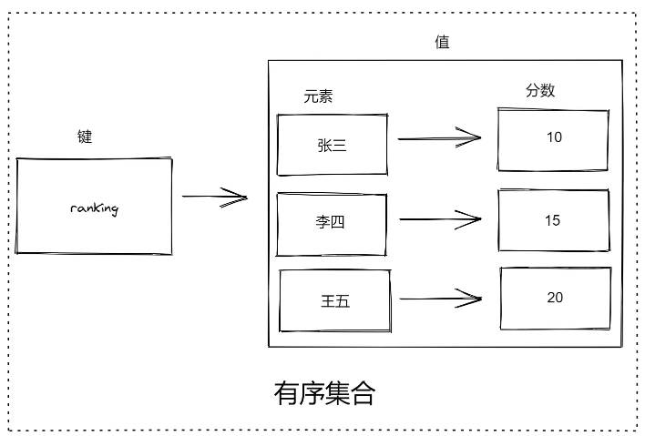

# Redis 常用数据类型及操作命令（CRUD）

Redis 不是简单的键值存储，它实际上是一个数据结构服务器，支持不同类型的值。这意味着在传统键值存储中，您将字符串键与字符串值相关联，而在 Redis 中，该值不仅限于简单的字符串，还可以容纳更复杂的数据结构。以下是 Redis 中支持的所有数据结构的列表：  

|   |   |
|---|---|
|类型|说明|
|String|字符串|
|Hash|散列，是由与值相关联的字段组成的内容。字段和值都是字符串。这与 Ruby 或 Python 哈希非常相似。  <br>类似于 JavaScript 中的对象结构。|
|List|列表，根据插入顺序排序的字符串元素的集合。它们基本上是链表。|
|Set|未排序的字符串元素集合，集合中的数据是不重复的。|
|ZSet|与 Sets 类似，但每个字符串元素都与一个称为分数的浮点值相关联。元素总是按它们的分数排序，因此与 Sets 不同，可以检索一系列元素（例如，您可能会问：给我前10名或后10名）。|
|Bit arrays（或 bitmaps）|可以使用特殊命令像位数组一样处理字符串值：您可以设置和清除单个位，计数所有设置为1的位，找到第一个设置或未设置的位，依此类推。|
|HyperLogLogs|这是一个概率数据结构，用于估计集合的基数。|
|Streams|提供抽象日志数据类型的类似地图项的仅追加集合。|

## Redis 中的键  
  
Redis 密钥是二进制安全的，这意味着您可以使用任何二进制序列作为 key，从 "foo" 之类的字符串到 JPEG 文件的内容。空字符串也是有效的键。  
  
有关键的其他一些规则：  
- 太长不好，占用内存空间  
- 太短也不好，没有可读性  
- 尝试坚持使用固定规则，例如：  
	- object-type:id  
	- user:1000  
	- 点或破折号通常用于多字字段，例如：comment:1234:reply.to 或 comment:1234:reply-to 中。  
- 允许的最大大小为 512 MB  

总结一下：  
- 不要太长，浪费空间  
- 不要过短，不利于阅读  
- 统一的命令规范  

## 字符串（String）  
  
字符串类型是 Redis 中最基本的数据类型，也是其它数据类型的基础。  
- 它能存储任何形式的字符串，包括二进制数据。  
- 你可以用它存储用户的邮箱、JSON 化的对象，甚至是一张图片  
- value 最多可以容纳数据大小为 512 MB

字符串类型是其他常见 4 种数据类型的基础，其他数据类型和字符串类型的差别从某种角度来说只是组织字符的形式不同。

例如，列表类型是以列表的形式组织字符串，而集合类型是以集合的形式组织字符串。

### 添加
```sh
# 设置指定 key 的值
SET key value

127.0.0.1:6379> set aa 5
OK

# 将给定 key 的值设为 value ，并返回 key 的旧值(old value)
GETSET key value

127.0.0.1:6379> getset aa 6
"5"
127.0.0.1:6379> get aa
"6"

# 只有在 key 不存在时设置 key 的值
SETNX key value

# aa存在 返回0 表示未设置成功
127.0.0.1:6379> setnx aa 7
(integer) 0
127.0.0.1:6379> get aa
"6"

127.0.0.1:6379> setnx cc 8
(integer) 1

# 同时设置一个或多个 key-value 对
MSET key value [key value ...]
127.0.0.1:6379> mset a 6 b 6 c 7
OK

# 同时设置一个或多个 key-value 对，当且仅当所有给定 key 都不存在
MSETNX key value [key value ...]

127.0.0.1:6379> msetnx d 9 e 10
(integer) 1

# 如果 key 已经存在并且是一个字符串， APPEND 命令将指定的 value 追加到该 key 原来值（value）的末尾。
APPEND key value
127.0.0.1:6379> append a hello
(integer) 6
127.0.0.1:6379> get a
"6hello"
```
>注意：在 Redis 中命令不区分大小写。也就是说 `SET foo bar` 和 `set foo bar` 是一样的，但是我们约定使用大写表示它是一个 Redis 命令。

### 查询 
```sh
# 获取指定 key 的值
GET key

127.0.0.1:6379> get a
"5"

# 返回 key 中字符串值的子字符 索引从0开始
GETRANGE key start end

127.0.0.1:6379> set info 'hello ok'
OK
127.0.0.1:6379> getrange info 6 7
"ok"

# 获取所有(一个或多个)给定 key 的值
MGET key [key ...]
127.0.0.1:6379> mget a b c
1) "5"
2) "6"
3) "7"
  
# 返回 key 所储存的字符串值的长度。
STRLEN key
127.0.0.1:6379> strlen info
(integer) 8

# 通用命令：查询集合中是否有指定的 key
EXISTS key [key ...]
127.0.0.1:6379> exists info
(integer) 1

# 通用命令，查询 key 的类型
TYPE key
127.0.0.1:6379> type a
string
127.0.0.1:6379> type myhash
hash
127.0.0.1:6379> type list
list
127.0.0.1:6379> type myset
set
```
  
### 修改  
  
```sh
# 设置指定 key 的值
SET key value
127.0.0.1:6379> set a 66
OK
127.0.0.1:6379> get a
"66"

# 将给定 key 的值设为 value ，并返回 key 的旧值(old value)
GETSET key value
127.0.0.1:6379> getset a 77
"66"
127.0.0.1:6379> get a
"77"

# 如果 key 已经存在并且是一个字符串， APPEND 命令将指定的 value 追加到该 key 原来值（value）的末尾。
APPEND key value
127.0.0.1:6379> append a ok
(integer) 4
127.0.0.1:6379> get a
"77ok"
```

### 删除  

```sh
# 通用命令：删除1个或多个指定的 key
DEL key [key ...]
127.0.0.1:6379> del a
(integer) 1
```

### 数字值  

>数字值在 Redis 中以字符串保存。  

```sh
# 将 key 中储存的数字值增一
INCR key
127.0.0.1:6379> set a 7
OK
127.0.0.1:6379> incr a
(integer) 8
127.0.0.1:6379> get a
"8"

# 将 key 所储存的值加上给定的增量值（increment）
INCRBY key increment
127.0.0.1:6379> incrby a 10
(integer) 18
127.0.0.1:6379> get a
"18"

# 将 key 中储存的数字值减一
DECR key
127.0.0.1:6379> decr a
(integer) 17

# key 所储存的值减去给定的减量值（decrement）
DECRBY key decrement
127.0.0.1:6379> decrby a 10
(integer) 7
127.0.0.1:6379> get a
"7"
```

## 哈希（Hash）

哈希（也叫散列）类型也是一种字典结构，其存储了字段和字段值的映射，但字符值只能是字符串，不能其它数据类型，换句话说，散列类型不能嵌套其它数据类型。一个哈希类型可以包含至少 232 - 1 个字段。  **类似js中的对象**
>提示：除了散列类型，Redis 的其它数据类型同样不支持数据类型嵌套。



### 添加
```sh
# 将哈希表 key 中的字段 field 的值设为 value
HSET key field value [field value ...]
127.0.0.1:6379> hset user name tom age 18 gender man
(integer) 3

# 同时将多个 field-value (域-值)对设置到哈希表 key 中
HMSET key field value [field value ...]
127.0.0.1:6379> hmset student id 15 name lili class '四班'
OK

# 只有在字段 field 不存在时，设置哈希表字段的值
HSETNX key field value
127.0.0.1:6379> hsetnx user name joson
(integer) 0 # 返回0 name存在无法设置name值
127.0.0.1:6379> hsetnx user idcard 123456789
(integer) 1 # 给user haset添加idcard 字段
```

 **HSET 与 HMSET主要区别**

| 特性        | HSET                 | HMSET        |
| --------- | -------------------- | ------------ |
| **多字段支持** | Redis 4.0.0+ 支持多字段设置 | 始终支持多字段设置    |
| **返回值**   | 返回新增字段数量             | 始终返回 `OK`    |
| **版本兼容性** | 4.0.0+ 推荐使用，功能更强大    | 已弃用，建议逐步替换   |
| **语义清晰度** | 更符合“设置”操作的语义（可新增或覆盖） | 早期多字段设置的唯一选择 |
### 查询

```sh
# 获取所有哈希表中的字段
HKEYS key
127.0.0.1:6379> hkeys user
1) "name"
2) "age"
3) "gender"
4) "idcard"

# 获取哈希表中字段的数量
HLEN key
127.0.0.1:6379> hlen user
(integer) 4 # 哈希key总数

# 获取所有给定字段的值
HMGET key field1 [field2]
127.0.0.1:6379> hmget user name age gender
1) "tom"
2) "18"
3) "man"

# 获取存储在哈希表中指定字段的值
HGET key field
127.0.0.1:6379> hget user name
"tom"

# 获取在哈希表中指定 key 的所有字段和值
HGETALL key
127.0.0.1:6379> hgetall user
1) "name"
2) "tom"
3) "age"
4) "18"
5) "gender"
6) "man"
7) "idcard"
8) "123456789"

# 查看哈希表 key 中，指定的字段是否存在
HEXISTS key field
127.0.0.1:6379> hexists user name
(integer) 1
127.0.0.1:6379> hexists user home
(integer) 0

# 获取哈希表中所有值
HVALS key
127.0.0.1:6379> hvals user
1) "tom"
2) "18"
3) "man"
4) "123456789"
```

**`HSCAN` 命令语法**

```bash
HSCAN key cursor [MATCH pattern] [COUNT count]
```
- `key`：要遍历的哈希表的键名。
- `cursor`：游标，初始值为 `0`，用于记录遍历位置。
- `MATCH pattern`（可选）：匹配模式，支持通配符，用于筛选字段名。
- `COUNT count`（可选）：每次迭代返回的元素数量提示，默认值为 `1`
```sh
# 迭代哈希表中的键值对
HSCAN key cursor [MATCH pattern] [COUNT count]

127.0.0.1:6379> hscan user 0
1) "0" # 游标为 0 表示迭代完成
2) 1) "name" # 字段列表
   3) "tom" # 字段值
   4) "age"
   5) "18"
   6) "gender"
   7) "man"
   8) "idcard"
   9) "123456789"

# 匹配以 `a` 开头的字段（如 "age"）
127.0.0.1:6379> hscan user 0 match a*
1) "0" 
2) 1) "age"
   3) "18"

# 使用 COUNT 控制返回数量
# 建议每次返回 2 个字段
HSCAN user:1000 0 COUNT 2
# 可能返回：
1) "3"            # 新的游标
2) 1) "name"
   3) "Alice"
   4) "age"
   5) "30"

# 继续用新游标 3 迭代
HSCAN user:1000 3 COUNT 2
1) "0"
2) 1) "email"
   3) "alice@example.com"
   4) "city"
   5) "New York"
```

**注意**
1. **游标机制**：
    - **非阻塞**：`HSCAN` 是增量迭代，不会阻塞服务器。
    - **重复风险**：迭代期间如果哈希表被修改（如字段增删），可能会返回重复字段或遗漏字段，但最终会保证所有字段都被遍历到。
2. **COUNT 参数**：
    - 只是一个“建议值”，实际返回数量可能多于或少于 `COUNT`。
    - 数据量大时，适当增加 `COUNT` 可减少迭代次数（但单次耗时会增加）。
3. **MATCH 过滤**：
    - 类似 `KEYS` 命令的模式匹配，但结合 `HSCAN` 更高效。
    - 过滤是在遍历完数据后执行的，因此 `COUNT` 不保证返回匹配的数量。
4. **迭代完成条件**：
    - 当返回的游标为 `0` 时，表示迭代完成。

### 修改

```sh
# 将哈希表 key 中的字段 field 的值设为 value
HSET key field value [field value ...]
127.0.0.1:6379> hset user age 20
(integer) 0
127.0.0.1:6379> hget user age
"20"

# 为哈希表 key 中的指定字段的整数值加上增量 increment
HINCRBY key field increment
127.0.0.1:6379> hincrby user age 1
(integer) 21
```

### 删除

```sh
# 删除一个或多个哈希表字段
HDEL key field1 [field2]
127.0.0.1:6379> hgetall myhash2
 1) "name"
 2) "tom"
 3) "age"
 4) "9"
 5) "gender"
 6) "waman"
 7) "city"
 8) "beijing"
 9) "email"
10) "11@qq.com"
# 删除myhash2 中的email city gender 三个字段
127.0.0.1:6379> hdel myhash2 email city gender
(integer) 3
127.0.0.1:6379> hgetall myhash2
11) "name"
12) "tom"
13) "age"
14) "9"

# 删除整个数据字段
DEL key [key ...]
127.0.0.1:6379> del myhash2
(integer) 1
```


## 列表（List）

列表类型类似于编程语言中的数组，可以存储一个有序的字符串列表，常用的操作就是向列表两端添加元素，或者获得列表的某一个片段。

列表类型内部使用双向链表实现的，所有向列表两端添加元素的时间复杂度为`O(1)`，获取越接近两端的元素速度就越快。这意味着，即时是一个有几千万个元素的列表，获取头部或尾部的10条记录也是极快的（和从，只有20个元素的列表中，获取头部或尾部的10条记录的速度是一样的）。

不过使用链表的代价是通过索引访问元素比较慢。设想在 iPhone 发售当前有 1000 个人在商店排队购买，这时商家为了感谢大家的支持，决定奖励第486位的顾客异步免费的 iPhone。为了找到这第 486 位顾客，工作人员不得不从队首一个一个地数到 486 个人。但同时，无论队伍有多长，新来的人想加入队伍的话直接排到队尾就好了，和队伍里有多少人没有任何关系。这种情景与列表类型的特性很相似。

这种特性使列表类型能非常快速地完成关系数据库难以应付的场景：例如社交网站的新鲜事，我们关心的只是最新内容，使用列表类型存储，即使新鲜事的总数达到几千万个，获取其中最新的100条数据也是极快的。同样因为在两端插入记录的时间复杂度是O(1)，列表类型也适合用来记录日志，可以保证加入新日志的速度不会受到已有日志数量额影响。

一个列表最多可以包含 2^32-1个元素 (4294967295, 每个列表超过40亿个元素)。
### 添加
`LPUSH` 命令向其中添加一些元素。`LPUSH` 将元素添加到列表的左侧（头部）。`LPUSH` 命令接受两个或多个参数：列表的键（key）和要添加的值（value）。让我们创建一个名为 `mylist` 的列表，并添加值 `item1`、`item2` 和 `item3`：

```sh
# 将一个或多个值插入到列表头部
LPUSH key element [element ...]
127.0.0.1:6379> lpush mylist item1 item2 item3 item4 item5
(integer) 5
# 更插入的元素顺序，先进的在最后面，后进的在第一个元素
127.0.0.1:6379> lrange mylist 0 -1 # 0起始索引 -1结束索引即-1表示list中无论如何有多少元素 -1表示最后一个位置索引
1) "item5"
2) "item4"
3) "item3"
4) "item2"
5) "item1"

# 在列表的元素前或者后插入元素，pivot表示那个元素
LINSERT key BEFORE|AFTER pivot value

127.0.0.1:6379> linsert mylist before item2 tom
(integer) 6
127.0.0.1:6379> lrange mylist 0 -1
1) "item5"
2) "item4"
3) "item3"
4) "tom"
5) "item2"
6) "item1"
# 如果命令执行成功，返回插入操作完成之后，列表的长度。 如果没有找到指定元素 ，返回 -1 。 如果 key 不存在或为空列表，返回 0 。

# 将一个值插入到已存在的列表头部
LPUSHX key value
127.0.0.1:6379> lpushx mylist firstEle
(integer) 7
127.0.0.1:6379> lrange mylist 0 -1
1) "firstEle" # 在列表头部添加元素
2) "item5"
3) "item4"
4) "item3"
5) "tom"
6) "item2"
7) "item1"

# 通过索引设置列表元素的值
LSET key index value
127.0.0.1:6379> lset mylist 0 newFirstEle
OK
127.0.0.1:6379> lrange mylist 0 -1
1) "newFirstEle"
2) "item5"
3) "item4"
4) "item3"
5) "tom"
6) "item2"
7) "item1"

# 在列表中添加一个或多个值
RPUSH key value1 [value2]
127.0.0.1:6379> rpush mylist AA BB
(integer) 9
127.0.0.1:6379> lrange mylist 0 -1
1) "newFirstEle"
2) "item5"
3) "item4"
4) "item3"
5) "tom"
6) "item2"
7) "item1"
8) "AA"
9) "BB"

# 为已存在的列表添加值
RPUSHX key value
127.0.0.1:6379> rpushx mylist cc
(integer) 10
127.0.0.1:6379> lrange mylist 0 -1
 1) "newFirstEle"
 2) "item5"
 3) "item4"
 4) "item3"
 5) "tom"
 6) "item2"
 7) "item1"
 8) "AA"
 9) "BB"
10) "cc"
```

### 查询

```sh
 通过索引获取列表中的元素
LINDEX key index
127.0.0.1:6379> lrange mylist 0 -1
 1) "newFirstEle"
 2) "item5"
 3) "item4"
 4) "item3"
 5) "tom"
 6) "item2"
 7) "item1"
 8) "AA"
 9) "BB"
10) "cc"
127.0.0.1:6379> lindex mylist 4
"tom"

# 获取列表长度
LLEN key
127.0.0.1:6379> llen mylist
(integer) 10

# 获取列表指定范围内的元素
LRANGE key start stop
127.0.0.1:6379> lrange mylist 2 3
1) "item4"
2) "item3"

# 例如，要检索列表的最后一个元素，可以使用索引 -1：
127.0.0.1:6379> lrange mylist -1 -1
1) "cc"
```
`LRANGE` 命令检索列表的元素。`LRANGE` 返回列表中某个范围内的元素。`LRANGE` 命令接受三个参数：列表的键（key）、起始索引（start index）和结束索引（end index）。索引是基于 0 的，因此第一个元素位于索引 0 处。要检索列表的所有元素，我们可以使用起始索引 0 和结束索引 -1。

### 修改

```sh
# 通过索引设置列表元素的值
LSET key index value
127.0.0.1:6379> lset mylist 0 newFirstEle
OK
127.0.0.1:6379> lrange mylist 0 -1
1) "newFirstEle"
2) "item5"
3) "item4"
4) "item3"
5) "tom"
6) "item2"
7) "item1"
```


### 删除

```sh
# 移出并获取列表的第一个元素
LPOP key
127.0.0.1:6379> lrange mylist 0 -1
 1) "newFirstEle"
 2) "item5"
 3) "item4"
 4) "item3"
 5) "tom"
 6) "item2"
 7) "item1"
 8) "AA"
 9) "BB"
10) "cc"
127.0.0.1:6379> rpop mylist
"cc"

# 移出并获取列表的第一个元素， 如果列表没有元素会阻塞列表直到等待超时或发现可弹出元素为止
BLPOP key1 [key2 ] timeout
127.0.0.1:6379> blpop mylist 10
1) "mylist"
2) "newFirstEle"
127.0.0.1:6379> lrange mylist 0 -1
3) "item5"
4) "item4"
5) "item3"
6) "tom"
7) "item2"
8) "item1"
9) "AA"
10) "BB"
# 如果列表为空，返回一个 nil 。 否则，返回一个含有两个元素的列表，第一个元素是被弹出元素所属的 key ，第二个元素是被弹出元素的值。

redis 127.0.0.1:6379> BLPOP list1 100
1. (nil)
2. (100.06s)
# 在以上实例中，操作会被阻塞，如果指定的列表 key list1 存在数据则会返回第一个元素，否则在等待100秒后会返回 nil

# 移出并获取列表的最后一个元素， 如果列表没有元素会阻塞列表直到等待超时或发现可弹出元素为止
BRPOP key1 [key2 ] timeout
127.0.0.1:6379> brpop mylist 10
1) "mylist"
2) "BB"

# 从列表中弹出最后一个元素值，将弹出的元素插入到另外一个列表中并返回它； 如果列表没有元素会阻塞列表直到等待超时或发现可弹出元素为止
BRPOPLPUSH source destination timeout
127.0.0.1:6379> lrange mylist 0 -1
1) "item5"
2) "item4"
3) "item3"
4) "tom"
5) "item2"
6) "item1"
7) "AA"
127.0.0.1:6379> lrange mylist2 0 -1
8) "item"
127.0.0.1:6379> rpoplpush mylist mylist2 # 将mylist最后一个元素移动到mylist2中
"AA"
127.0.0.1:6379> lrange mylist2 0 -1
9) "AA"
10) "item"

# 移除列表元素
# count > 0 : 从表头开始向表尾搜索，移除与 VALUE 相等的元素，数量为 COUNT 。
# count < 0 : 从表尾开始向表头搜索，移除与 VALUE 相等的元素，数量为 COUNT 的绝对值。
# count = 0 : 移除表中所有与 VALUE 相等的值。
LREM key count value
127.0.0.1:6379> lpush listEle hello hello ok hello ok aa aa
(integer) 7

# count > 0 
127.0.0.1:6379> lrem listEle 2 aa # 表头到尾，移除2个元素
(integer) 2
127.0.0.1:6379> lrange listEle 0 -1
1) "ok"
2) "hello"
3) "ok"
4) "hello"
5) "hello"

# count < 0 
127.0.0.1:6379> lrange listEle 0 -1 # 表尾到头，移除2个hello元素
1) "ok"
2) "hello"
3) "ok"

# count = 0
127.0.0.1:6379> lrem listEle 0 ok
(integer) 2
127.0.0.1:6379> lrange listEle 0 -1
1) "hello"

# 对一个列表进行修剪(trim)，就是说，让列表只保留指定区间内的元素，不在指定区间之内的元素都将被删除
LTRIM key start stop # 截取
127.0.0.1:6379> lrange listEle 0 -1
1) "cc"
2) "bb"
3) "aa"
4) "hello"
5) "hello"
127.0.0.1:6379> ltrim listEle 0 2
OK
# 截取后的list
127.0.0.1:6379> lrange listEle 0 -1
1) "cc"
2) "bb"
3) "aa"

# 移除列表的最后一个元素，返回值为移除的元素
RPOP key
127.0.0.1:6379> rpop listEle
"aa"

# 移除列表的最后一个元素，并将该元素添加到另一个列表并返回
RPOPLPUSH source destination

127.0.0.1:6379> lrange listEle 0 -1
1) "cc"
2) "bb"
127.0.0.1:6379> lrange mylist2 0 -1
3) "AA"
4) "item"
# 将listEle中的bb 元素移动到 mylist2中
127.0.0.1:6379> rpoplpush listEle mylist2
"bb"
127.0.0.1:6379> lrange mylist2 0 -1
5) "bb" # here
6) "AA"
7) "item"
```

## 集合（Set）

集合类型和数学中的集合概念相似，集合中的元素是唯一的、无序的，简单理解集合就是没有顺序且不重复的列表。

一个集合类型可以存储至多 2^32 - 1 个字符串。

集合类型和列表类型有相似之处，它们的主要区别是：
- 列表是有序的，集合是无序的
- 列表数据可以重复，集合中没有重复数据

集合类型的常用操作是向集合中加入或删除元素、判断某个元素是否存在等。由于集合类型在 Redis 内部是使用值为空的散列表实现的，所以这些操作的时间复杂度都是O(1)。

最方便的是多个集合之间还可以进行并集、交集和差集运算。

### 添加

```sh
# 向集合添加一个或多个成员
SADD key member1 [member2]

127.0.0.1:6379> sadd myset a1 b2 c3
(integer) 3
```

### 查询
```sh
# 返回集合中的所有成员
SMEMBERS key
127.0.0.1:6379> smembers myset
1) "a1"
2) "b2"
3) "c3"

# 获取集合的成员数
SCARD key
127.0.0.1:6379> scard myset
(integer) 3

# 判断 member 元素是否是集合 key 的成员
SISMEMBER key member
127.0.0.1:6379> sismember myset a1
(integer) 1

# 返回集合中一个或多个随机数
SRANDMEMBER key [count]
127.0.0.1:6379> srandmember myset 2
1) "a1"
2) "c3"
```

### 删除
```sh
# 移除集合中一个或多个成员
SREM key member1 [member2]
127.0.0.1:6379> srem myset a1 c3
(integer) 2
127.0.0.1:6379> smembers myset
1) "b2"
2) "e4"

# 移除并返回集合中的一个随机元素
SPOP key
127.0.0.1:6379> spop myset
"e4"
127.0.0.1:6379> smembers myset
1) "b2"

# 将 member 元素从 source 集合移动到 destination 集合
SMOVE source destination member
127.0.0.1:6379> smove myset1 myset2 cc
(integer) 1
127.0.0.1:6379> smembers myset1
1) "aa"
2) "bb"
127.0.0.1:6379> smembers myset2
3) "dd"
4) "ee"
5) "ff"
6) "cc" # here
```
### 集合间聚合运算
多个集合之间还可以进行**并集**、**交集**和**差集**运算。
```sh
# 返回第一个集合与其他集合之间的差异。返回给定所有集合的差集
SDIFF key1 [key2]
127.0.0.1:6379> smembers myset1
1) "aa"
2) "bb"
3) "ff"
127.0.0.1:6379> smembers myset2
4) "dd"
5) "ee"
6) "ff"
7) "cc"
127.0.0.1:6379> sdiff myset1 myset2
8) "aa"
9) "bb"
# set1 与 set2 比较，set1的差异ff都有，aa 和 bb set2没有

# 返回给定所有集合的交集
SINTER key1 [key2]
127.0.0.1:6379> sinter myset1 myset2
1) "ff"

# 返回所有给定集合的并集
SUNION key1 [key2]
127.0.0.1:6379> sunion myset1 myset2
1) "aa"
2) "bb"
3) "ff"
4) "dd"
5) "ee"
6) "cc"

# 返回给定所有集合的差集并存储在 destination 中
SDIFFSTORE destination key1 [key2]
127.0.0.1:6379> sdiffstore mydiff myset1 myset2
(integer) 2
127.0.0.1:6379> smembers mydiff
1) "aa"
2) "bb"

# 返回给定所有集合的交集并存储在 destination 中
SINTERSTORE destination key1 [key2]
127.0.0.1:6379> sinterstore myinster myset1 myset2
(integer) 1
127.0.0.1:6379> smembers myinster
1) "ff"

# 所有给定集合的并集存储在 destination 集合中
SUNIONSTORE destination key1 [key2]
127.0.0.1:6379> sunionstore myunion myset1 myset2
(integer) 6
127.0.0.1:6379> smembers myunion
1) "aa"
2) "bb"
3) "ff"
4) "dd"
5) "ee"
6) "cc"
```

### 使用场景

- 跟踪一些唯一性数据
	- 比如访问网站的唯一 IP 地址信息，每次访问网站的时候记录用户 IP 地址，SET 自动保证数据的唯一不重复
- 充分利用 SET 聚合操作方便高效的特性，用于维护数据对象之间的关联关系
	- 比如所有购买A商品的客户 ID 存储到指定的 SET 中，所有购买B商品的客户 ID 存储到指定的 SET 中，如果我们想要获取有哪个客户同时购买了这两个商品，我们只需要使用交集操作就可以轻松的查出来

## 有序集合（Sorted Set）

有序集合是一种类似于集合和哈希之间的混合数据类型。

- 与集合一样，排序集合由**唯一的非重复字符串元素组成**
- 有序集合中的元素不排序，但有序集合中的每个元素都关联了一个分数（这就是为什么类型也类似于哈希，因为每个元素都映射到一个值）
- 虽然集合中每个元素都是不同的，但是它们的分数确可以相同

>每个元素都会关联一个 double 类型的分数。Redis 正是通过分数来为集合中的成员进行从小到大的排序。

有序集合类型在某些方面和列表类型有些相似。
相同点：
- 两者都是有序的
- 两者都可以获得某一范围的元素
  
不同点：
- 列表类型通过链表实现的，获取靠近两端的数据速度极快，而当元素增多后，访问中间数据的速度会较慢，所以它更适合实现如“新鲜事”或“日志”这样很少访问中间元素的应用
- 有序集合类似是使用哈希表实现的，所以即使读取位于中间部分的数据速度也很快
- 列表中不能简单的调整某个元素的位置，但是有序集合可以（通过更改元素的分数）
- 有序集合要比列表类型更耗费内存

### 有序集合的典型应用场景 
（1）排行榜  
例如一个大型在线游戏的积分排行榜，每当玩家的分数发生变化时，可以执行 `ZADD` 命令更新玩家的分数，此后再通过 `ZRANGE` 命令获取积分 TOPTEN 的用户信息。当然我们也可以利用 `ZRANK` 命令通过 username 来获取玩家的排行信息。最后我们将组合使用 `ZRANGE` 和 `ZRANK` 命令快速的获取和某个玩家积分相近的其他用户的信息。  
  
（2）微博热搜  
假设我们现在要获取热门的帖子或搜索，比如我们常用的微博热搜。  

首先，我们需要一个衡量的标准，定量的量度热搜的热门程度。假设我们有一个字段叫回复量，回复量越高就越热门。  

如果我们用关系型数据库来获取的话，用 SQL 语句实现很简单：
```sql
SELECT * FROM message ORDER BY backsum LIMIT 10
```

但是当数据量很大的时候，效率很低，同时如果建立索引又要消耗大量的资源，同时增加负载。

使用 Redis 的时候，我们不需要存储多余的信息，只需要存储帖子 id 和回复量两个信息就可以了。
### 添加
```sh
# 向有序集合添加一个或多个成员，或者更新已存在成员的分数
ZADD key score member [score member ...]
127.0.0.1:6379> zadd myzset 98 'tom' 98 'alex' 60 'joson' 60 'jojo' 80 'tina'
(integer) 5

127.0.0.1:6379> zrange myzset 0 -1
1) "jojo"
2) "joson"
3) "tina"
4) "alex"
5) "tom"

127.0.0.1:6379> zrange myzset 0 -1 WITHSCORES
 1) "jojo"
 2) "60"
 3) "joson"
 4) "60"
 5) "tina"
 6) "80"
 7) "alex"
 8) "98"
 9) "tom"
10) "98"
```

### 查询
```sh
# 通过索引区间返回有序集合指定区间内的成员，分数从低到高排序
ZRANGE key start stop [WITHSCORES]
127.0.0.1:6379> zrange myzset 0 -1 WITHSCORES # 递增排列
 1) "jojo"
 2) "60"
 3) "joson"
 4) "60"
 5) "tina"
 6) "80"
 7) "alex"
 8) "98"
 9) "tom"
10) "98"

# 通过索引区间返回有序集合指定区间内的成员，分数从高到低排序
ZREVRANGE key start stop [WITHSCORES]
127.0.0.1:6379> zrevrange myzset 0 -1 WITHSCORES # 递减排列
 1) "tom"
 2) "98"
 3) "alex"
 4) "98"
 5) "tina"
 6) "80"
 7) "joson"
 8) "60"
 9) "jojo"
10) "60"

# 返回有序集中指定分数区间内的成员，分数从低到高排序
ZRANGEBYSCORE key min max [WITHSCORES] [LIMIT offset count]
127.0.0.1:6379> zrangebyscore myzset 60 80 withscores # 返回分数介于60-80直接的人员
 1) "jojo"
 2) "60"
 3) "joson"
 4) "60"
 5) "peter"
 6) "65"
 7) "jack"
 8) "75"
 9) "tina"
10) "80"

127.0.0.1:6379> zrangebyscore myzset -inf +inf withscores
 1) "jojo"
 2) "60"
 3) "joson"
 4) "60"
 5) "peter"
 6) "65"
 7) "jack"
 8) "75"
 9) "tina"
10) "80"
11) "alex"
12) "98"
13) "tom"
14) "98"
# `+inf`（正无穷大）：表示分数范围的上限为最大值。
# `-inf`（负无穷大）：表示分数范围的下限为最小值。
# 这两个符号覆盖所有可能的分数值（从负无穷到正无穷）。

# 返回有序集中指定分数区间内的成员，分数从高到低排序
ZREVRANGEBYSCORE key max min [WITHSCORES] [LIMIT offset count]


# 返回有序集合中指定成员的排名，有序集成员按分数值（从小到大）排序
ZRANK key member

# 返回有序集合中指定成员的排名，有序集成员按分数值（从大到小）排序
ZREVRANK key member

# 获取有序集合的成员数
ZCARD key

# 返回有序集中，成员的分数值
ZSCORE key member

# 计算在有序集合中指定区间分数的成员数
ZCOUNT key min max

```