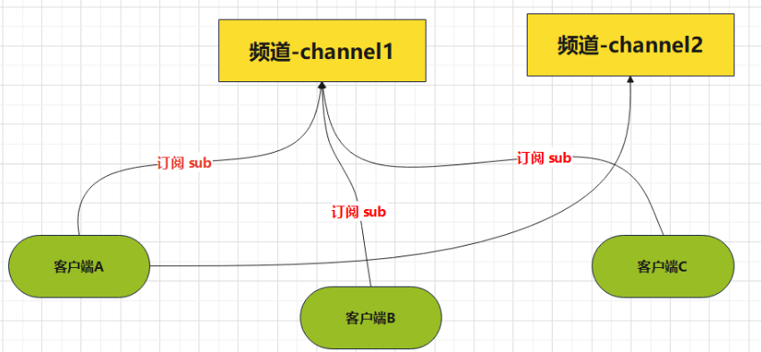
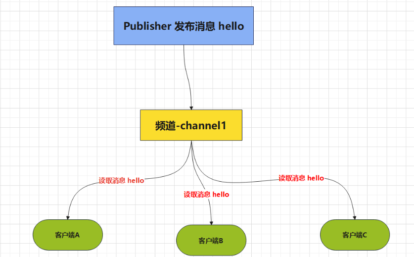

## 发布 和 订阅的概念
**Redis 发布(pub) 订阅(sub) 是一种消息通信模式：发送者(pub) 发送信息，订阅者(sub) 接收信息** 。

- 订阅：subscribe
- 发布：publish

Redis 客户端可以订阅任意数量的频道。

**客户端订阅频道示意图：**


**当给这个频道发布消息后，消息就会发送给订阅了的客户端：**


>发布了一个消息 Hello ，给了对应的频道，然后这些订阅了该频道的客户端，就会读取到发布的（Hello）的消息。

**客户端可以订阅多个频道。可以发布多个消息给多个频道** 。

**任务队列：**
1. 顾名思义，就是“传递消息的队列”
2. 与任务队列进行交互的实体有两类：
    一类是：生产者(producer) ，
    另一类则是消费者(consumer)
**生产者** 将需要处理的任务放入到**任务队列** 当中，而**消费者** 则不断地从任务队列中读取任务信息并执行。
>	1.Subscriber：看作是收音机 。可以收到多个频道，并以队列方式显示。
>	2.Publisher：看做是电台 。可以往不同的 FM 频道中发送消息。
>	3.Channel：不同频率的 FM 频道
>从 Pub/Sub 的机制来看，它更像是一个广播系统，多个订阅者(Subscriber) 可以订阅多个频道(Channel) ，多个发布者(Publisher) 可以往多个频道(Channel) 中发布消息。

## 创建订阅频道
使用 SUBSCRIBE 创建订阅频道

```sh
# 订阅给定的一个或多个频道的信息。
SUBSCRIBE channel [channel ...]

A客户端
# 当前客户端订阅了一个 mychannel的频道
127.0.0.1:6379(subscribed mode)> subscribe mychannel
1) "subscribe"
2) "mychannel"
3) (integer) 1
Reading messages... (press Ctrl-C to quit or any key to type command)

# "subscribe"：这表明你已成功订阅了一个频道。
# "mychannel"：这是你订阅的频道的名称。
# (integer) 1：这是你当前订阅的频道数量。
```

打开一个新的客户端窗口，发布订阅消息。
```sh
PUBLISH channel msg 命令用于将信息发送到指定的频道。

B客户端
127.0.0.1:6379> publish mychannel 'hello, redis'
(integer) 1
```
此时A客户端会接受的B客户端发来的消息
```sh
127.0.0.1:6379(subscribed mode)> subscribe mychannel
1) "subscribe"
2) "mychannel"
3) (integer) 1
4) "message"
5) "mychannel"
6) "hello, redis" # 接受到的消息
```

## `UNSUBSCRIBE` 取消订阅频道
```sh
UNSUBSCRIBE [channel ...] 取消订阅指定的频道，如果不指定频道，则会取消所订阅的所以频道
127.0.0.1:6379(subscribed mode)> unsubscribe mychannel
1) "unsubscribe"
2) "mychannel"
3) (integer) 0

# "unsubscribe"：这表明你已取消订阅了一个频道。
# "mychannel"：这是你取消订阅的频道的名称。
# (integer) 0：这是你当前订阅的频道数量。现在是 0，因为你已取消订阅 `mychannel`。
```

## `PSUBSCRIBE` 进行模式订阅
`PSUBSCRIBE pattern [pattern ...]` 订阅一个或多个符合给定模式的频道，每个模式以 `*` 作为匹配符，比如`it*` 匹配所有以 it 开头的频道(it.news，it.blog，it.tweets 等等)；`news.*` 匹配所有以 `news.` 开头的频道(new.it，new.global.today 等等)，诸如此类。
```sh
使用 PSUBSCRIBE 命令订阅与模式 news.* 匹配的频道
127.0.0.1:6379> psubscribe new.*
1) "psubscribe"
2) "new.*"
3) (integer) 1
Reading messages

# "psubscribe"：这表明你已成功订阅了一个模式。
# "news.*"：这是你订阅的模式。 .* 是一个通配符，可以匹配任何字符。
# (integer) 1：这是你当前订阅的模式数量。
```
使用的`PUBLISH` 命令向 `news.sports` 频道发布一条消息：
```sh
127.0.0.1:6379> publish new.sports 'sports new msg'
(integer) 1
```
此时订阅了 new.*的频道接收到其他客户端发布的消息
```sh
127.0.0.1:6379> psubscribe new.*
1) "psubscribe"
2) "new.*"
3) (integer) 1
4) "pmessage"
5) "new.*"
6) "new.sports"
7) "sports new msg"
```

## 查看当前订阅信息

`PUBSUB <subcommand> [argument [argument …]]`是一个查看订阅与发布系统状态的内省命令
```sh
# 用于查看订阅与发布系统状态，它由数个不同格式的子命令组成。
PUBSUB <subcommand> [argument [argument ...]]

127.0.0.1:6379> pubsub channels # 由活跃频道组成的列表。
1) "mychannel" 
```

## 退订所有给定模式的频道

 `PUNSUBSCRIBE [pattern [pattern ...]]` 退订指定的规则，如果没有参数则会退订掉**所i有规则**。
```sh
# Punsubscribe 命令用于退订所有给定模式的频道。
127.0.0.1:6379(subscribed mode)> punsubscribe mychannel
1) "punsubscribe"
2) "mychannel"
3) (integer) 0
```


参考文章：[Redis当中的“发布” 和 “订阅”](https://rainbowsea.blog.csdn.net/article/details/145403662)