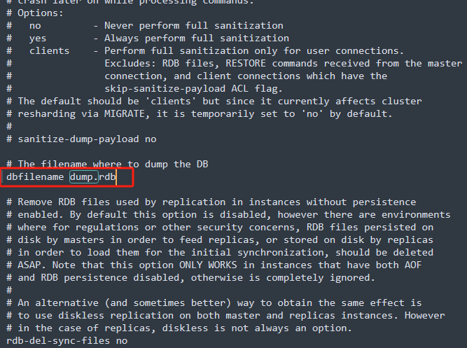
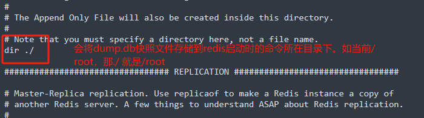
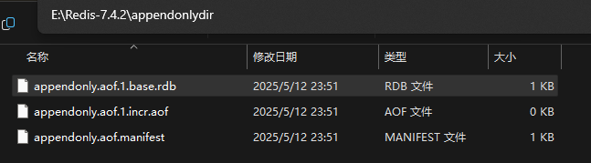

Redis 的强劲性能很大程度上是由于其将所有数据都存储在内存中，然而当 Redis 重启或宕机后，所有存储在内存中的数据就会丢失。在一些情况下，我们会希望 Redis 在重启后能够保证数据不丢失。

这时我们希望 Redis 能将数据从内存中以某种形式同步到硬盘中，使得重启后可以根据硬盘中的记录恢复数据。这一过程就是持久化。

Redis 提供了两种持久化方案：

- RDB 持久化，根据指定的规则“定时”将内存中的数据存储在硬盘上，在重启之后读取硬盘上的 `.rdb` 快照文件将数据恢复到内存中。
- AOF 持久化：AOF 持久化记录服务器执行的所有写操作命令形成 `.aof` 日志文件保存到硬盘中，并在服务器启动时，通过重新执行这些命令来还原数据集。

## RDB

RDB 方式的持久化是通过快照完成的，当符合一定条件时 Redis 会自动将内存中的所有数据生成一份副本并存储在硬盘上，这个过程即为“快照”。

Redis 允许用户自定义快照条件，当符合快照条件时，Redis 会自动执行快照操作。进行快照的条件可以由用户在配置文件中自定义，由两个参数构成：时间窗口 M 和改动的键的个数 N。每当时间 M 内被更改的键的个数大于 N 时，即符合自动快照条件。
### RDB 持久化执行流程
**RDB 及其执行流程：**


流程如下：
1. Redis 客户端执行 bgsave 命令或者自动触发 bgsave 命令。
2. 主进程判断当前是否已经存在**正在执行的子进程** ，如果存在，那么主进程直接返回。
3. 如果不存在，正在执行的子进程 ，那么就 fork 一个新的子进程进行持久化数据，fork 过程是阻塞的，fork 操作完成后主进程即可执行其它操作。
4. 子进程先将数据写入到 临时的 **rdb 文件**中 ，待快照数据写入完成后，再原子替换旧的 rdb 文件。
5. 同时发送信号给主进程，通知主进程 rdb 持久化完成，主进程更新相关的统计信息。

小结：
- 整个过程中，主进程是不进行任何 IO 操作的，这就确保了极高的性能。
- 如果需要进行大规模数据的恢复，且对于数据恢复的完整性不是非常敏感，那 RDB 方式要比 AOF 方式更加的高效。
- RDB的缺点是最后一次持久化的数据可能丢失。
如果你是正常关闭 Redis ，仍然会进行持久化，不会造成数据丢失。如果是 Redis 异常终止/宕机 ，就可能造成数据丢失。

### RDB 的详细配置

**1.默认快照配置：**

Redis 当中的快照的文件是名为 `dump.rdb` 文件，这是默认的。在 /etc/redis.conf 中配置文件名称当中，存在这个 `dump.rdb` 的配置。


生成的快照默认为 Redis 启动时命令行所在的目录下：

在`/usr/local/bin` 目录下，启动 Redis, 这个那么这里的 `./` 所指的路径就是 `/usr/local/bin` , 如果你在 `/root/` 目录下启动 Redis , 那么这里 `./` 所指的就是 `/root`/ 下了路径 。

那么这样的默认配置就存在一个问题，那就是，如果我们每次去到不同的目录下启动 redis 的化，那么这个dump.rdb（快照存储我们信息/数据的文件） 就会存储到不同的目录下，这样就导致了，如果该目录下没有我们之前执行存储的数据的 dump.rdb 文件的话，我们Redis 就无法读取到该存有我们之前dump.rdb 数据的文件，也就无法恢复我们之前存储操作的数据了。

可以自定义配置好这个 dump.rdb 文件的存放路径，不是默认的dir./(根据启动Redis目录不同而变化) ，而是一直配置在一个固定的路径下。就可以解决这个问题了。

这里我们将其配置到 /root/ 目录下，这样我们每次生成的 dump.rdb 文件就一直是在同一个路径的目录下。修改redis.cofig 文件
```sh
dir /root/
```
2. **save 和 bgsave** 
使用save 和 bgsave 进行redis持久化快照
```sh
127.0.0.1:6379> save
OK
127.0.0.1:6379> bgsave
Background saving started
```
- **save ：** save 时只管保存，其它不管，全部阻塞。手动保存，不建议。
- **bgsave：** Redis 会在后台异步进行快照操作，快照同时还可以响应客户端请求。
- 可以通过 **lastave** 命令获取最后一次成功执行快照的时间(unix 时间戳)，可以使用工具转换。

RDB 相关的当前配置。我们可以使用 `CONFIG GET` 命令来检索当前配置。
```sh
127.0.0.1:6379> CONFIG GET save
1) "save"
2) "3600 1 300 100 60 10000"
```
如果经过 900 秒且至少 1 个键（key）已更改，或者如果经过 300 秒且至少 10 个键已更改，或者如果经过 60 秒且至少 10000 个键已更改，Redis 将自动将数据库保存到磁盘。

上**默认的快照配置：** 如图：同样是在 `redis.conf文件当中配置的。`

save 3600 1：在3600秒时间段，有1个key变化，就进行RDB备份
save 300 100：在300秒时间段，有100个key变化，就进行RDB备份
save 60 10000：在60秒时间段，有10000个key变化，就进行RDB备份

1.每60秒，进行key变化统计
2.60秒结束后，下一个60秒为新的统计时间段

如果我们没有开启 save 的注释 那么在退出,Redis 时 也会进行备份 更新 dump.rdb 文件的。

3. **flushall**
- 执行 flushall 命令，也会产生 dump.rdb 文件，数据为空。
- `Redis Flushall` 命令用于清空整个 Redis 服务器的数据(删除所有数据库的所有 key )
```sh
127.0.0.1:6379> flushall
OK
```

4. **stop-writes-on-bgsave-error**

>当 Redis 无法写入磁盘的话(比如磁盘满了), 直接关掉 Redis 的写操作。推荐 yes

5. **rdbcompression**
- 对于存储到磁盘中的快照，可以设置是否进行压缩存储。如果是的话，redis 会采用 **LZF** 算法进行压缩。
- 如果你不想消耗 CPU 来进行压缩的话，可以设置为关闭此功能，默认 yes。


5. **rdbchecksum**
```txt
rdbchecksum yes
```
- 在存储快照后，还可以让 redis 使用 CRC64算法来进行数据校验，保证文件是完整的。
- 但是这样做会增加大约 10% 的性能消耗，如果希望获取到最大的性能提升，可以关闭此功能，推荐 yes 打开。

6. 动态停止RDB
 `redis-cli config set save ""` ，就是给 save 属性赋值为 `""`空字符串，表示禁用保护策略。这里使用命令是让 客户端在此刻，启动的客户端停止 RDB，一旦退出了该客户端就，该配置就失效了。RDB 持久化策略又启动了。

eg：
需求: 如果 Redis 的 key 在 30 秒内，有 5 个 key 变化，就自动进行 RDB 备份。
```txt
# 在redis.config文件中添加 
# save 3600 1 300 100 60 10000
save 30 5
```
当redis在30秒内 set 5个key后，就会自动生成更新dump.db文件

### RDB 持久化小结(优势 和 劣势)

**优势：**
1. 适合大规模的数据恢复
2. 对数据完整性和一致性要求不高更适合使用
3. 节省磁盘空间
4. 恢复速度快

劣势：
1. 虽然 Redis 在 fork 时使用了写时拷贝技术(Cop-On-Write) ，但是如果数据庞大时还是比较消耗性能。
2. 在备份周期在一定间隔时间做一次备份，所以如果 Redis 意外 down 掉 的话(如果正常关闭 Redis仍然会进行 RDB 备份，不会丢失数据)，就会丢失最后一次快照后的所有修改。

## AOF

快照功能并不是非常持久（durable）： 如果 Redis 因为某些原因而造成故障停机， 那么服务器将丢失最近写入、且仍未保存到快照中的那些数据。

尽管对于某些程序来说， 数据的持久性并不是最重要的考虑因素， 但是对于那些追求完全持久化（full durability）的程序来说， 快照功能就不太适用了。

从 1.1 版本开始， Redis 增加了一种完全耐久的持久化方式： AOF 持久化。

AOF 可以将 Redis 执行的每一条写命令操作日志存储到硬盘文件中，这一过程显然会降低 Redis 的性能，但是大部分情况下这个影响是可以接受的，另外使用较快硬盘可以提供 AOF 性能。

AOF 机制对于日志的写入操作采用的是 `append` 模式，就是追加模式，因此在写入过程中如果出现宕机问题，也不会破坏已经写入的日志数据。

1. 以日志的形式来记录每个写 操作(增量保存) ，将 Redis 执行过的所有写指令记录下来(比如 set/del 操作会记录)，读操作 get 不记录）
2. 只许追加文件但不可以改写文件
3. Redis 启动之初会读取文件重新构建数据
4. redis 重启的话就根据日志文件的内容将写指令从前到后执行一次，以完成对数据的恢复工作。
### AOF 持久化流程


流程如下：
1. 客户端的请求写命令会被 append 追加到 AOF 缓冲区内
2. AOF 缓冲区根据 AOF 持久化策略(always，everysec，no) 将操作 sync 同步到磁盘的 AOF 文件中
3. AOF 文件大小超过重写策略或手动重写时，会对 AOF 文件 rewrite 重写，压缩 AOF 文件容量
4. Redis 服务重启时，会重新 load 加载 AOF 文件中的写操作达到数据恢复的目的。

### AOF的配置

关于 AOF 的配置和 RDB 的配置都是一样的，都是在 /etc/redis.conf 文件当中配置的。
在 redis.conf 中配置文件名称，默认为 `appendonly.aof` 文件，作为备份快照文件的。

设置为yes 将AOF持久化开启，同时默认的文件名为`appendonly.aof`
```txt
# 修改redis.config
appendonly yes
```
重启redis
```sh
127.0.0.1:6379> shutdown # redis-server服务关闭
```
修改redis.config文件后，启动redis
```sh
.\redis-server.exe .\redis.conf
```
当启动完成之后，会在当面./dir 的目录下生成`appendonlydir`文件夹。


从 Redis7 版本开始，使用一组 aof 文件记录数据，分为两种基本类型：

1. 基本文件，表示文件创建时的完整的数据，可以是 rdb 或 aof 内容格式
2. 增量文件，记录前一个文件之后的新增命令
3. 清单文件，追踪文件的创建和使用顺序

-  appendonly.aof.1.base.rdb 作为基础文件。
- appendonly.aof.1.incr.aof、appendonly.aof.2.incr.aof 作为增量文件。
- appendonly.aof.manifest 作为清单文件。

**重点：**
- AOF 文件的保存路径，同 RDB 的路径是一致的配置，都是存储到同一个地方的。RDB 配置的路径是在哪里 ,AOF 配置的路径也就是在哪里。
- **AOF 和 RDB 同时开启，系统默认取 AOF 的数据** 。当开启 AOF 后，Redis 从 AOF 文件取数据。

当redis执行set 删除 和 修改、读写操作，appendonly.aof.1.incr.aofd的增量文件大小发送变化。
```sh
127.0.0.1:6379> set a a
OK
127.0.0.1:6379> set b b
OK
127.0.0.1:6379> set c c
OK
127.0.0.1:6379> set c c3
OK
127.0.0.1:6379> del b
(integer) 1
127.0.0.1:6379> get a
"a"
127.0.0.1:6379> get c
"c3"
127.0.0.1:6379> set bb bb
OK
```
打开查看appendonly.aof.1.incr.aofd增量文件，AOF 只会备份 执行了修改(写/改)操作的指令，并
不会备份get(获取汹操作指令)。

>AOF 只对 set[添加/修改] 和 del 操作记录下来了。get[读]操作，并没有记录下来。

1. **appendfsync** 写回策略

Redis 是先执行写操作命令，再将该命令记录到 AOF 日志，只有写操作命令执行成功，才会进行记录，这两个操作都在主线程进行，都会占用磁盘 I/O，因此 AOF 日志写回磁盘的时机很重要

写回策略分为三种：

- always（谨慎使用）：每条 Redis 操作命令都会写入磁盘，最多丢失一条数据
- everysec（默认）：每秒钟写入一次磁盘，最多丢失一秒的数据
- no（不推荐）：由操作系统决定何时写入磁盘，Linux 默认 30s 写入一次数据至磁盘


2. rewrite 压缩
AOF 文件越来越大，需要定期对 AOF 文件进行重写达到压缩。
旧的 AOF 文件含有无效命令被忽略，保留最新的数据命令，比如 ：set a a1；set a b1；set a c1； 保留最后一条指令就可以了。
多条写命令可以合并为一个，比如 ： set a c1 b b1 c c1
AOF 重写降低了文件占用空间
更小的 AOF 文件可以更快的被 Redis 加载。

第一种方式：客户端执行 BGREWRITEAOF 命令触发重写，不会阻塞 redis 服务
```sh
# 手动触发
127.0.0.1:6379> bgrewriteaof
```
第二种方式：在服务器配置自动触发

```txt
auto-aof-rewrite-percentage 100
auto-aof-rewrite-min-size 64mb
```
- auto-aof-rewrite-min-size : AOF 文件最小重写大小，只有当 AOF 文件大小大于 该值的时候才能重写，默认配置 64MB。
- auto-aof-rewrite-percentage ：当前 AOF 文件大小和最后一次重写的大小之间的比率等于或者大于指定的增长百分比，比如 100 代表当前 AOF 文件时上次重写的两倍时候才重写。

如上配置，启用 AOF 持久化后，当 AOF 文件体积大于 64 M，并且 AOF 文件体积比上次重写之后体积大了至少一倍时，会自动触发重写

指定百分比为 0 可以禁用自动 AOF 重写
```sh
auto-aof-rewrite-percentage 0
```

## 参考文章
[Redis 持久化-RDB](https://rainbowsea.blog.csdn.net/article/details/145445778)
[Redis 持久化-AOF](https://rainbowsea.blog.csdn.net/article/details/145445865)
[Redis 持久化机制](https://www.cnblogs.com/Yee-Q/p/16573521.html)